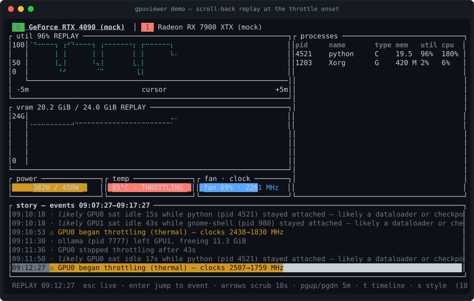
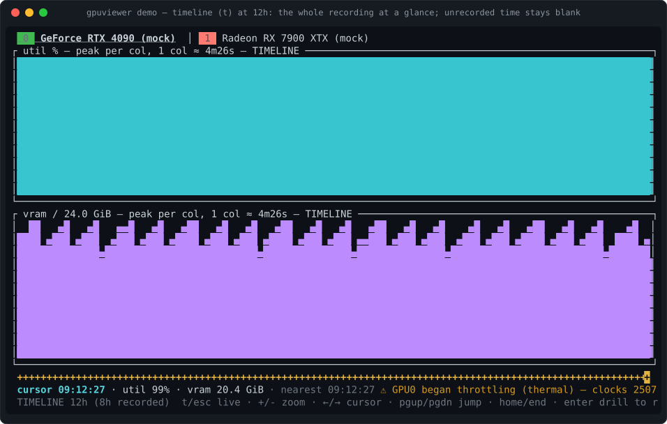

<div align="center">


# gpuviewer

### — the GPU flight recorder —

**It was already recording. Scroll back to 02:14 — it'll tell you why.**

[](https://github.com/singhpratech/gpuviewer/actions/workflows/ci.yml)
[](#license)
[](#status)
[](#status)
[](#architecture)
[](#architecture)

**[singhpratech.github.io/gpuviewer](https://singhpratech.github.io/gpuviewer/)** — scrub
an example night in your browser

[Install](#install) · [Quick start](#quick-start) · [How it compares](#how-it-compares) ·
[Honesty contract](#the-honesty-contract) · [Status](#status) ·
[Architecture](#architecture) · [Keybinds](#keybinds)

</div>

---

Your training run stalled at 02:14. You were asleep. Every other monitor would have shown
you a beautiful live gauge — of a moment that no longer exists.

**gpuviewer** is a GPU monitor — Linux (NVIDIA · AMD · Intel) validated on real hardware;
Windows and macOS Apple Silicon support newly in-tree, compiles + CI-tested with hardware
validation pending ([status](#status)) — that records persistent,
per-process history and a narrated event log **just by being open** — no daemon to install,
no recording you had to remember to start. The next morning you scroll back to the moment
it happened and read the story: the throttle onset with clock deltas, the VRAM climb with
an ETA, the process that exited and what it freed. Facts are asserted plainly; inferences
are always labeled **"likely"** and expand to the raw evidence behind them. One
unprivileged binary.

<p align="center">
  
</p>
<p align="center"><sub><em>The built-in demo (<code>gpuviewer demo</code>, simulated data, labeled as such) opens
already scrolled back to the night's last throttle onset — the first thing you see is the answer, not a gauge.</em></sub></p>

## Three altitudes on one recording

| | view | question it answers |
|---|---|---|
| 🔭 | **Timeline** (`t`) | *"What did the whole night look like?"* — hours of history as solid strips, event markers underneath |
| 🎞️ | **Replay** (`r`, or `Enter` on anything) | *"What exactly happened at 02:14?"* — full charts, processes, gauges, story feed at any recorded moment |
| 📡 | **Live** | *"What is it doing right now?"* — and it's recording the other two views while you watch |

You move between them with single keys: spot the anomaly on the timeline, `Enter` to drill
into replay at that exact column, `Esc` back to live. The cursor line always shows the
nearest recorded event.

<p align="center">
  
</p>
<p align="center"><sub><em>The timeline zooms from 1h to 7d (<code>+</code>/<code>-</code>). Each column is the recorded peak —
and time that wasn't recorded stays <strong>blank</strong>, never painted as zero. The footer says exactly how much is real: "12h (8h recorded)".</em></sub></p>

## What it tells you

Example narrations, in the exact shape the event engine emits them. The tag is the
confidence tier: facts are observed state transitions; inferences always say "likely" in
the sentence itself and carry the raw numbers in an auditable evidence field.

- `[fact]` GPU0 began throttling (thermal) — clocks 2520→1815 MHz
- `[fact]` GPU0 stopped throttling after 1m 31s
- `[likely]` GPU0 VRAM 92% and climbing ~270 MiB/min — likely full in ~8 min (largest holder: python pid 4521)
- `[likely]` GPU0 sat idle 47s while python (pid 4521) stayed attached — likely a dataloader or checkpoint stall
- `[likely]` GPU0: python (pid 4521) likely hung — held 20.1 GiB for 10m 12s with zero GPU activity, process still alive
- `[likely]` ollama (pid 7777) loaded 11.3 GiB but GPU1 is ~idle while its CPU runs hot — likely partial CPU offload (model may not fit in VRAM)
- `[fact]` collection stalled 4.2s — a backend probe blocked; the data gap is recorded, last good frame at 02:14:31
- `[fact]` python (pid 4521) left GPU0, freeing 21.3 GiB

Inference thresholds are deliberately conservative — a hang is only narrated after ten
unbroken minutes of held VRAM with zero engine activity, and any break in the premise drops
the claim silently. A confidently-wrong narration is worse than no narration.

## The morning-after digest

Plain text, no ANSI, paste-able into Slack or a bug report:

```console
$ gpuviewer report --since 22:00
gpuviewer report — 2026-06-06 22:00 .. 2026-06-07 08:41 (23 events: 17 facts, 6 inferences)

GPU0 (GeForce RTX 4090): util avg 81% / max 99%, temp max 88°C, mem max 23.3 GiB, throttle buckets 14
GPU1 (Radeon RX 7900 XTX): util avg 12% / max 87%, temp max 71°C, mem max 12.4 GiB, throttle buckets 0

23:41:07  INFO  [fact]    ollama (pid 7777) attached to GPU1, using 11.3 GiB
02:14:31  WARN  [fact]    GPU0 began throttling (thermal) — clocks 2520→1815 MHz
02:14:48  INFO  [likely]  GPU0 sat idle 17s while python (pid 4521) stayed attached — likely a dataloader or checkpoint stall
02:16:02  INFO  [fact]    GPU0 stopped throttling after 1m 31s
03:02:11  WARN  [likely]  GPU0 VRAM 92% and climbing ~270 MiB/min — likely full in ~8 min (largest holder: python pid 4521)
06:58:40  INFO  [fact]    python (pid 4521) left GPU0, freeing 21.3 GiB
```

## Install

```sh
# Linux / macOS
curl -fsSL https://raw.githubusercontent.com/singhpratech/gpuviewer/main/install.sh | sh
# Windows (PowerShell)
irm https://raw.githubusercontent.com/singhpratech/gpuviewer/main/install.ps1 | iex
```

The scripts verify the download's SHA256 against the release's checksum file before
installing, drop a single binary in your user bin dir, and never need root/admin. They
work once the first release is tagged; until then `cargo build --release` always does.

Packaged builds (Linux `tar.gz`/`.deb`/`.rpm`/AppImage, Windows `zip`, macOS `tar.gz` —
with checksums and build-provenance attestations) are produced per release tag. Every
install path, platform note (Windows SmartScreen, macOS quarantine), and verification step
lives in [`docs/packaging/installing.md`](docs/packaging/installing.md).

## Quick start

```sh
cargo build --release                # binary at target/release/gpuviewer
gpuviewer                            # live TUI — already recording
gpuviewer demo                       # 8h simulated incident, opens at the throttle onset
gpuviewer report --since 12h         # the digest above, from your real history
gpuviewer export --since 2h oom.gpvr # shareable incident slice
gpuviewer view oom.gpvr              # replays anywhere — no GPU required
```

No GPU? No problem — `--mock` (also the automatic fallback) runs the full TUI on simulated
GPUs. Mock data is always labeled "(mock data)" and records to a separate database, never
your real history.

**Boot-time recording.** "Always-on" means by virtue of normal use — there is deliberately
no daemon. If you want the recording running from login instead, run the headless stream
under a systemd user unit; a ready-made example with mild, GPU-safe hardening (and a
comment explaining every directive) ships at
[`docs/packaging/gpuviewer.service`](docs/packaging/gpuviewer.service) —
`systemctl --user enable --now gpuviewer.service`. The per-database instance lock makes
this safe alongside the interactive TUI: while the unit holds the recording, a TUI you
open by hand runs live-only (and says so), and `report`/replay/`view` read the same
history concurrently.

**Scripting and agents.** One NDJSON frame per tick plus that tick's narrated events, every
metric nullable, versioned and conformance-tested:

```sh
gpuviewer --json --once              # one frame + its events to stdout, then exit 0
```

The stream contract — frames *and* events in one timestamped stream, JSON Schema, written
compatibility promise — is [`docs/spec/ndjson-v1.md`](docs/spec/ndjson-v1.md). Events can
also drive your own plumbing: `--on-event 'CMD'` runs a command per event with
`GPV_EVENT_*` in the environment (rate-capped), e.g.
`--on-event 'curl -s -d "$GPV_EVENT_TITLE" ntfy.sh/mytopic'`.

## How it compares

The honest version: several good tools own one half of the flight-recorder sentence. The
combination — always-on by virtue of normal use, per-process, scroll-back replay, narrated
causes under a facts-vs-"likely" contract, in one unprivileged binary — is the part that's
ours.

| | gpuviewer | nvtop | all-smi | qmassa | LACT | gpud | netdata |
|---|:---:|:---:|:---:|:---:|:---:|:---:|:---:|
| Always-on recording, no setup/daemon | ✓ | — | — ¹ | — ¹ | — | ◐ ⁴ | ◐ ³ |
| Scroll-back replay in-tool | ✓ | — | ✓ ¹ | ✓ ¹ | — | — | ✓ ³ |
| Narrated causes, facts vs "likely" | ✓ | — | — | — | ◐ ² | ◐ ⁴ | — |
| Per-process attribution (NVIDIA + AMD + Intel incl. xe) | ✓ | ✓ | ◐ ⁵ | ◐ ⁵ | — | — | — |
| Single unprivileged binary | ✓ | ✓ | ✓ | — ⁶ | — | ◐ ⁴ | — |

¹ all-smi (`record` → `view --replay`) and qmassa (`-t` → `replay`) both ship real TUI
replay — **of recordings you explicitly started beforehand**. Great when you knew the
incident was coming; no help for the one you didn't predict.

² LACT decodes throttle causes on all three vendors and shades them on its charts — in a
live GUI with an in-memory window (ephemeral; no persisted event log, no replay).

³ netdata's history is the real thing (per-second, ~14-day default retention, scrub-back
dashboards) — device-level, as a daemon with per-collector GPU configuration, no per-process
GPU, and threshold alerts rather than causes.

⁴ gpud ships genuine fact-tier events (Xid, kmsg, hw-slowdown) from a single binary — built
as a fleet-health daemon, NVIDIA-focused, no scroll-back timeline, no narration.

⁵ all-smi: multi-vendor including Intel i915 + xe, but no AMD. qmassa: AMD + Intel, no
NVIDIA.

⁶ qmassa's deeper telemetry is sudo-gated.

If one of those fits your problem better, use it — LACT for fan/OC control, netdata for
fleet dashboards, gpud for cluster health verdicts. (Cells reflect our reading of each tool
as of June 2026; corrections welcome.)

## The honesty contract

A flight recorder you can't trust is decoration. Every design decision below exists because
a confidently-wrong number would kill the whole premise:

- **Facts vs inferences.** Every event carries `confidence: fact | likely`. Facts (a
  throttle bit set, a process gone from the list) are asserted plainly. Inferences (stall,
  hang, spillover, OOM ETA) always read as hedged and carry an `evidence` field with the raw
  numbers — visible in the TUI, the digest, and the JSON stream.
- **"Utilization" is duty-cycle, not saturation.** It measures the fraction of time at least
  one kernel was resident — a GPU at "100%" may be nowhere near compute- or bandwidth-bound.
  It is never presented as capacity used.
- **Absence is a normal outcome, not an error.** Every metric is nullable. Driver
  `NOT_SUPPORTED`, missing sysfs/hwmon files, MIG mode, and privilege walls render as
  "unavailable" — never zero, never a crash. Where the reason is knowable it is explained
  in-UI: on WSL2, per-process GPU attribution is unavailable *at the driver level* and the
  process pane says so; without root/`CAP_SYS_PTRACE`, fdinfo can only attribute your own
  processes and the pane shows a "your processes only" hint rather than pretending the list
  is complete.
- **Unrecorded time renders blank.** On the timeline and every chart, a gap in the recording
  is a visible hole — never interpolated, never painted as zero activity.
- **The recorder reports on itself.** A blocked driver probe or missed tick becomes a
  recorded `[fact]` event ("collection stalled … the data gap is recorded") — a hole in the
  recording never masquerades as the GPU having gone quiet. A quarantined-and-recreated
  history file is narrated as a history reset, for the same reason.
- **Polling must not perturb what it measures.** Idle GPUs are polled on a stretched cadence
  (up to 5× the interval) so monitoring doesn't keep them awake or break GFXOFF; the
  effective cadence is shown in the footer rather than hidden; `--no-backoff` opts out.
- **Self-impact is measured, not assumed.** On the dev machine (RTX 4090 Laptop + Intel
  iGPU, two backends polled at a 1 s interval), 60 s of headless recording costs
  1.6 CPU-seconds — ≈2.7% of one core — at ~25 MiB RSS, and the full TUI measures
  the same ≈2.8%. Numbers vary with GPU count, driver, and kernel; remeasure yours with
  `/usr/bin/time -v gpuviewer --json > /dev/null`.
- **Mock data is always labeled.** The footer says "(mock data)" exactly when the data is
  mock — including replays of mock recordings — and mock/demo runs record to separate
  database files, never your real history.
- **No vendor SDK is hard-linked, no vendor CLI is exec'd.** NVML is loaded at runtime; AMD
  and Intel are read straight from the kernel's sysfs/fdinfo interfaces.

## The journey

This project was built research-first, and the research is in the repo:

1. **Study the field before writing code.** [`docs/research/`](docs/research/) holds the
   June-2026 evidence — the market gap, every competitor's actual capabilities (with issue
   numbers), the vendor API minefield, and the stack decision record
   ([`04-synthesis.md`](docs/research/04-synthesis.md)). The architecture wasn't guessed;
   it was argued in writing.
2. **Learn from other people's scars.** No vendor SDK is hard-linked because soname churn
   broke btop on AMD twice. NVML is loaded by its versioned name (`libnvidia-ml.so.1`)
   because the bare `.so` only exists with the CUDA toolkit installed. Polling is adaptive
   because monitoring tools have kept GPUs awake (bottom #1291) and broken GFXOFF. WSL2's
   per-process wall is detected and explained because crashing on it is a known trap
   (nvtop #459).
3. **Mock-first, so everything is testable.** The full suite passes on machines with no
   GPU: a deterministic mock backend implements the same trait as the real ones, sysfs/fdinfo
   collectors read from committed fixture trees, and the NDJSON contract has a conformance
   suite that runs the built binary against the spec.
4. **Ship the recorder, then the narrator, then the time machine.** History rollups came
   first, then the event engine with the facts-vs-likely contract, then scroll-back replay,
   then `.gpvr` export, and most recently the zoomed-out timeline — each layer riding on the
   one before it.

## Status

**Working pre-release (v0.1.0).** Install paths:
[`docs/packaging/installing.md`](docs/packaging/installing.md).

| Platform | Backends | Tier |
|---|---|---|
| Linux | NVIDIA (NVML, runtime-loaded) · AMD (sysfs/`gpu_metrics`/fdinfo) · Intel (i915 + xe) | Developed and validated on real hardware |
| Windows | NVIDIA (NVML device truth + PDH per-process fill, joined by LUID↔PCI match) · cross-vendor WDDM (PDH: NVIDIA/AMD/Intel device + per-process) | Compiles + CI-tested; hardware validation pending |
| macOS Apple Silicon | Device-level only — per-process GPU is OS-prohibited and the UI says so, never fakes it | Compiles + CI-tested; hardware validation pending |

Shipped — in the binary today:

- **Backends:** NVIDIA (NVML, runtime-loaded — never hard-linked), AMD (sysfs/hwmon +
  versioned `gpu_metrics` throttle decoders v1.1–v3.0 + fdinfo), Intel (fdinfo in both the
  i915 and xe dialects + sysfs), deterministic mock fallback. Devices deduped across
  backends by PCI address.
- **Always-on recording:** SQLite (WAL) 10s/1m rollups + an append-only event log, with
  per-process rollups (memory, util, CPU%, container identity when knowable), retention
  sweeps, and corrupt-database quarantine. Raw 1 Hz samples never touch disk — the live
  window rides in RAM rings.
- **Timeline overview:** the whole recording as solid strips, 1h–7d zoom, peak-per-column
  (labeled as such), event lane, time cursor with nearest-event readout, `Enter` drills into
  replay at the cursor. Gaps stay blank.
- **Scroll-back replay:** `r` from the live view, or `Enter` on any event in the story feed
  to jump straight to it; scrub by 10s/5m; works on your real history, the demo, and
  exported recordings.
- **Narrated events:** throttle onset/recovery with clock deltas, process attach/exit with
  freed VRAM, VRAM-pressure ETA, idle gap, suspected hang, CPU spillover, collector
  stall/slow-probe self-reports, history reset.
- **Chart styles:** braille step-outline (default) or solid fill — `c` toggles, your pick;
  both break honestly at recording gaps.
- **Subcommands and sinks:** `report` (plain-text digest), `demo` (pre-seeded incident),
  `export`/`view` (shareable `.gpvr` incident files that replay anywhere, no GPU required),
  `--json` (NDJSON contract v1 with JSON Schema and a conformance test that runs the built
  binary), `--on-event` command sink, adaptive idle backoff.
- **Tests:** the full suite passes on machines with no GPU — everything runs against the
  mock backend and committed sysfs/fdinfo fixture trees.

In progress / not yet:

- First published binaries — the release pipeline (tar.gz/zip/deb/rpm, drafted per tag,
  provenance-attested) is in-tree; artifacts appear with the next tagged release.
- Real-hardware soak across the driver matrix — a manual pre-release checklist by design;
  CI stays GPU-free. Windows and macOS are at the compiles + CI-tested tier until then.
- iced GUI (v2) — see roadmap.

## Architecture

```
gpuviewer-core      trait GpuBackend (nvtop's vtable, translated to Rust)
                    ├─ nvidia: nvml-wrapper (runtime dlopen, never hard-linked)
                    │          + on Windows: per-process fill from the shared PDH snapshot
                    ├─ amd:    sysfs/hwmon/gpu_metrics(v1.1–v3.0)/fdinfo (zero library deps)
                    ├─ intel:  fdinfo (i915 + xe dialects) + sysfs
                    ├─ wddm:   Windows cross-vendor (DXGI + PDH + D3DKMT — OS surfaces only)
                    ├─ apple:  macOS device-level (Metal; private tiers gated post-WWDC26)
                    └─ mock:   deterministic simulation (CI + demo; no GPU required)
gpuviewer-history   RAM rings (live window) → 10s/1m SQLite rollups + event log
gpuviewer-tui       ratatui — live · timeline · replay, story feed
                    + report · demo · export (.gpvr) · view   (+ --json mode)
```

Built in Rust, all-Rust dependency tree. Missing drivers degrade gracefully,
`NOT_SUPPORTED` is a normal per-metric outcome, and the tool never out-consumes what it
monitors (adaptive polling; low-power cadence surfaced in the footer).

### Keybinds

Every navigation key has a letter alias — Mac laptops have no `PgUp`/`PgDn`/`Home`/`End`
and terminals tend to eat the `Fn`+arrow substitutes. One rule across all modes:
`w`/`a`/`s`/`d` mirror the arrows, `A`/`D` (shifted) mirror `PgUp`/`PgDn`, `g`/`G`
mirror `Home`/`End`.

| Live | |
|---|---|
| `q` / `Esc` | quit |
| `←` `→` / `a` `d` / `Tab` / `Shift-Tab` | switch device |
| `p` | pause/resume collection |
| `↑` `↓` / `w` `s` then `Enter` | jump to a story-feed event |
| `r` | replay at the newest recorded moment |
| `t` | timeline overview |
| `c` | chart style: braille ↔ solid |

| Replay | |
|---|---|
| `Esc` / `r` | back to live (inert in `view` — a file has no live mode behind it) |
| `←` `→` / `a` `d` | scrub 10s |
| `PgUp` / `PgDn` / `A` / `D` | scrub 5m |
| `Home` / `g` | oldest recorded moment |
| `End` / `G` | newest recorded moment |
| `↑` `↓` / `w` `s` then `Enter` | jump to the selected event |
| `t` / `c` | timeline · chart style |

| Timeline | |
|---|---|
| `t` / `Esc` | back to live (to the pinned replay in `view` — a file has no live mode) |
| `+` / `-` | zoom: 1h · 3h · 6h · 12h · 24h · 48h · 7d |
| `←` `→` / `a` `d` | move the time cursor (footer shows the nearest event) |
| `PgUp` / `PgDn` / `A` / `D` | jump 10 columns |
| `Home` / `End` / `g` / `G` | window edges |
| `Tab` / `Shift-Tab` | switch device |
| `Enter` | **drill into replay at the cursor** |

### Retention defaults

| | granularity | kept for |
|---|---|---|
| recent past | 10s rollups | 48 hours |
| long tail | 1m rollups | 30 days |
| event log | every event | 30 days |

History lives in your user data directory, resolved per-OS:

| | default `history.db` location |
|---|---|
| Linux | `$XDG_DATA_HOME/gpuviewer` → `~/.local/share/gpuviewer` |
| macOS | `~/Library/Application Support/gpuviewer` |
| Windows | `%LOCALAPPDATA%\gpuviewer` |

`--db` overrides it, `--no-persist` disables recording (which the replay view and `report`
need). `--mock` records to `history-mock.db` and `demo` to `history-demo.db` — your real
history is never polluted by simulations, and recording the wrong flavour into a database
is refused before a single row lands. One recorder owns a database at a time (an exclusive
lock on `<db>.lock`); a second gpuviewer opened by hand runs live-only and says so.

### Roadmap

- **v1.5 — Windows NVIDIA:** NVML + PDH dual-source — NVML for device truth, Windows GPU
  performance counters for the per-process VRAM/util that NVML architecturally cannot see
  under WDDM (an honest per-process number where Task Manager misleads). *Dual-source
  fusion in-tree: compiles + CI-tested, hardware validation pending.* The cross-vendor
  WDDM backend (device + per-process AMD/Intel/NVIDIA via PDH) landed alongside it, same
  tier.
- **v2 — macOS Apple Silicon:** device-level telemetry only (per-process GPU is
  OS-prohibited, and we say so in-UI rather than fake it) + an iced GUI from the same
  core. *Device-level backend in-tree: compiles + CI-tested, hardware validation pending;
  GUI not started.*
- **v2+:** Prometheus exporter, multi-host views, vendor-depth Windows AMD/Intel beyond
  the WDDM device tier.

Deliberately not chasing: fan/OC control (LACT owns it), a daemon/client split ("always-on"
means by virtue of normal use — for boot-time recording, run `gpuviewer --json` under your
own systemd user unit; an example ships at
[`docs/packaging/gpuviewer.service`](docs/packaging/gpuviewer.service)), cluster views, and
eBPF causal tracing (we hand off to profilers: "idle gap at 02:14:31 — if recurring,
capture a trace").

## License

Licensed under either of

- Apache License, Version 2.0 ([LICENSE-APACHE](LICENSE-APACHE) or <http://www.apache.org/licenses/LICENSE-2.0>)
- MIT license ([LICENSE-MIT](LICENSE-MIT) or <http://opensource.org/licenses/MIT>)

at your option.

Unless you explicitly state otherwise, any contribution intentionally submitted
for inclusion in the work by you, as defined in the Apache-2.0 license, shall be
dual licensed as above, without any additional terms or conditions.
